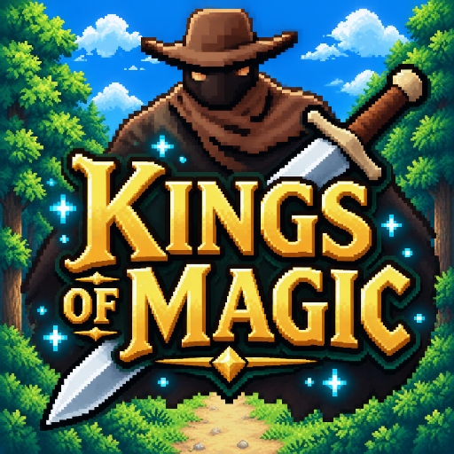

# Kings of Magic

2D-idle боец в Unity: бьёшь врагов, получаешь опыт и монеты, прокачиваешь
статы и оружие, проходишь тиры врагов до Джунглевого Президента.

Проект сделан на **Unity 2022.3.62f3**, ориентирован на **Яндекс Игры** (WebGL)
и Android.



## Игровой цикл

1. Атакуешь кнопкой — урон идёт по HP врага, полоска над его головой плавно
   уменьшается.
2. Враг отвечает ударами и тратит твою энергию. На падение HP/энергии влияет
   прокачка.
3. За убийство даются монеты и опыт. Уровень растёт, за каждый новый уровень
   выдаётся 3 очка статов.
4. Полоска прокачки уровня показывает реальный процент, а не «уровень N».
5. Прогресс сохраняется в `PlayerPrefs` — монеты, честь, уровень, очки статов,
   купленное оружие, HP и энергия.

## Механики

### Бой

| Параметр | Значение |
| --- | --- |
| Атака игрока | кул задары, кулдаун 1 с |
| Задержка респауна врага | 5 с |
| Задержка респауна игрока | 3 с |
| Стоимость рывка | 25 энергии |
| Кулдаун рывка | 15 с |
| Шанс уклонения | показывается прямо на кнопке «Рывок» |

Кнопка «Рывок» показывает три состояния: `Готов`, таймер кулдауна в секундах и
текущий шанс уклонения в процентах. Если уклонение сработало, следующий удар
врага по игроку не проходит.

### Прокачка

Опыт до следующего уровня считается как `level * 100`. Потраченные очки идут
в пять веток:

| Ветка | Даёт |
| --- | --- |
| Ближний бой | +5 макс. энергии за уровень |
| Защита | +5 макс. HP за уровень |
| Меч | урон сабли |
| Оружие | урон катаны |
| Магия | заготовка под магию |

Максимальный уровень — 2800.

### Оружие

Три слота, клик по ячейке экипирует предмет:

- **Кулаки** — всегда доступны, базовый стиль боя.
- **Сабля** — 3 урона, 500 монет.
- **Катана** — 6 урона, 1000 монет.

Купленное оружие переживает перезапуск. Спрайты подгружаются из
`Resources/Sprites` (`Weapon2`, `Katana`), `WeaponVisual` позиционирует их в
руке персонажа.

### Тиры врагов

Враг подбирается по уровню игрока. При падении уровня ниже порога тир
откатывается назад.

| Тир | С уровня игрока | Враг | Ур. | HP | Урон | Монеты | Опыт | Честь |
| --- | --- | --- | --- | --- | --- | --- | --- | --- |
| 1 | 1 | Бандит | 5 | 100 | 3 | 75 | 70 | 0 |
| 2 | 10 | Джунглевый житель | 14 | 170 | 9 | 85 | 230 | 0 |
| 3 | 15 | Горилла | 20 | 220 | 14 | 205 | 750 | 0 |
| 4 | 25 | Джунглевый Президент (босс) | 25 | 950 | 28 | 2150 | 11000 | 625 |

Смена тира меняет спрайт врага и фон сцены.

## Скрипты

Все скрипты в `Assets/Scripts/`, UI собран на стандартном `UnityEngine.UI`.

| Файл | Ответственность |
| --- | --- |
| `GameManager.cs` | Прогресс, монеты, честь, уровни, статы, оружие, сохранение |
| `PlayerAttack.cs` | Урон по врагу, полоска HP над головой, выбор тира врага |
| `EnemyAttack.cs` | Урон по игроку, полоски HP/энергии, респаун, загрузка HP |
| `DodgeController.cs` | Кнопка «Рывок», кулдаун, шанс уклонения |
| `SaberShop.cs` | Покупка и экипировка сабли и катаны |
| `WeaponCell.cs` | Ячейка оружейного слота, визуал «надето / не куплено» |
| `WeaponVisual.cs` | Спрайт оружия в руке персонажа |
| `AdsTimer.cs` | Таймер показа межстраничной рекламы (по умолчанию 300 с) |
| `FullscreenAd.cs` | Обёртка над Yandex Mobile Ads (файл Яндекса) |

## Реклама

`FullscreenAd.cs` — файл из Yandex Advertising Network, менять его не нужно.
`AdsTimer.cs` вызывает его раз в `interval` секунд (по умолчанию 5 минут) и
автоматически стартует вместе со сценой.

Рекламный SDK лежит в `Assets/YandexMobileAds/`, WebGL-шаблоны Яндекс Игр — в
`Assets/WebGLTemplates/`, медиация AppMetrica — в `Assets/AdRevenue/`.

## Сборка

### WebGL (Яндекс Игры)

1. Unity Hub → **2022.3.62f3** → открыть папку проекта.
2. **File → Build Settings** → платформа **WebGL** → **Switch Platform**.
3. Выбрать сцену `Assets/Scenes/SampleScene.unity`, нажать **Build**.
4. Залить папку сборки в консоли Яндекс Игр.

### Android

1. **File → Build Settings** → **Android** → **Switch Platform**.
2. В **Player Settings** задать package name, версию и ключ подписи.
3. **Build** (apk) или **Build App Bundle (Google Play)**.

Сборка Android требует Android SDK/NDK и JDK, установленных через Unity Hub.

## Структура проекта

```
Assets/
  AdRevenue/         медиация AppMetrica
  Audio/             звук
  Font/              шрифт
  Plugins/           нативные плагины (Android, iOS)
  Resources/         спрайты оружия, загружаемые по пути
  Scenes/            SampleScene — единственная сцена игры
  Scripts/           игровая логика
  Sprites/           спрайты персонажей, врагов, UI
  WebGLTemplates/    шаблоны Яндекс Игр
  YandexMobileAds/   рекламный SDK
```

## Лицензия

[MIT](LICENSE) © 2026 Facts566
